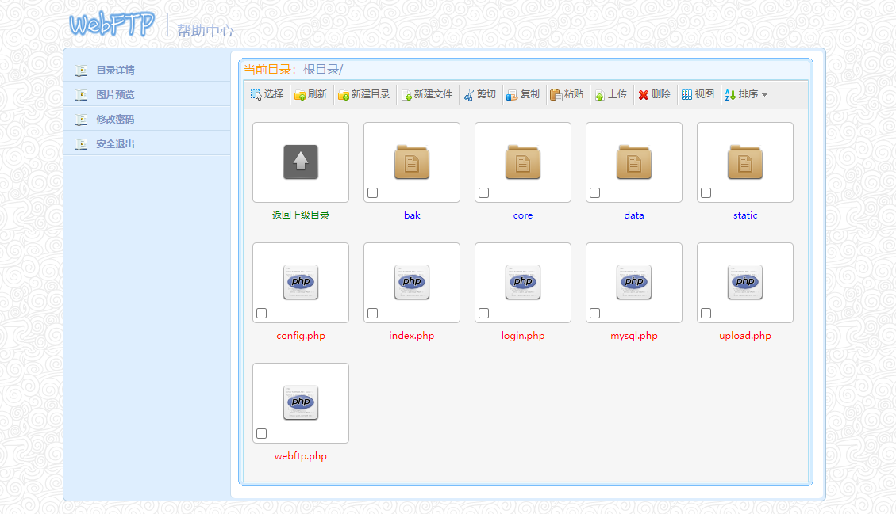
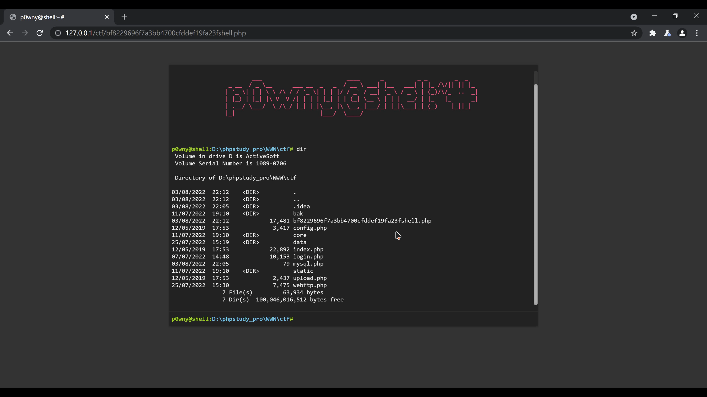

# CUC-web-SQL-Injection

本项目是2022信息安全综合实践的一个结课大作业。

## 功能清单

- 基于网页的用户登录系统
  - 使用合法用户名和口令登录系统
- 基于网页的文件管理系统
  - 用户可以查看文件系统，包括目录结构，可以统计文件夹数目和文件数目，以及总大小
  - 用户可以对文件进行管理，包括新建目录、新建文件、剪切、复制、粘贴功能，可以更改列表视图和排序方式
  - 用户可以修改密码，可以退出账号
- 基于网页的文件下载系统
  - 用户可以上传和删除文件，上传的文件名会被加密
  - 支持多文件同时上传，并且有覆盖模式，覆盖同名文件

## 小组分工

按贡献度排名如下：

zhang-de-xin，xt0103，cucwzy，David-cluns，cuczbj，Eitan

> 具体工作见个人`README`

|         组员         |                          负责的工作                          |
| :------------------: | :----------------------------------------------------------: |
| zhang-de-xin，xt0103 | 后端环境搭建，服务器，数据库，解决网页代码的部分报错，使网站正常运行。 |
| cucwzy，David-cluns  |     编写前端代码，使用PHP搭建网站界面，实现网站的功能。      |
|    cuczbj，Eitan     |  进行break it，攻击网站，以及check和exp脚本，解题视频录制。  |

## 本项目用到的关键技术

- 前端使用`html`，`bootstrap`框架进行页面搭建，并使用`css`和`js`配合开发
- 后端使用`PHP`进行开发
- 服务器选用`Apache`，数据库使用`MySQL`

## 快速上手体验

这部分我们没有使用`docker`，因为组里没有成员掌握这项技术。

这里进行文件说明：

> `img`文件夹：内含`README`的图片
>
> `README`文件夹：内含成员的个人`README`，详细实践过程可以看这里
>
> `source`文件夹：内含网页源文件，包括数据库`.sql`文件。如需上手体验，则下载该文件，将`src`文件夹放入服务器的`htdocs`文件夹内，`.sql`文件导入数据库，并添加一个用户（具体看成员的`README`）
>
> `test`文件夹：内含我们的实践过程的测试文件
>
> `解题视频和脚本`文件夹：内含`exp.py`和`check.py`，以及解题操作视频

## 演示

登录页面：

登录后的页面：

破解：

