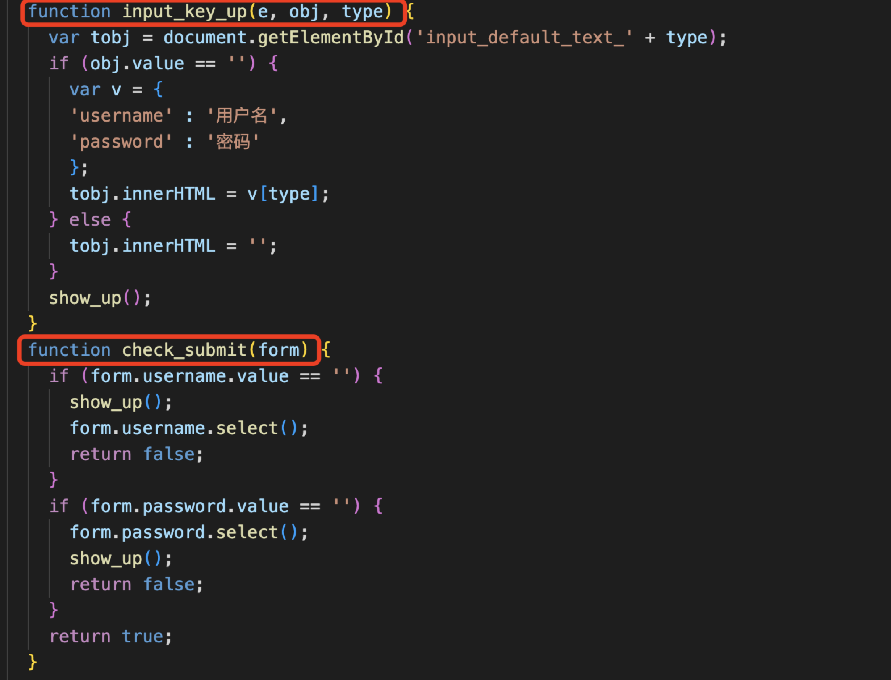
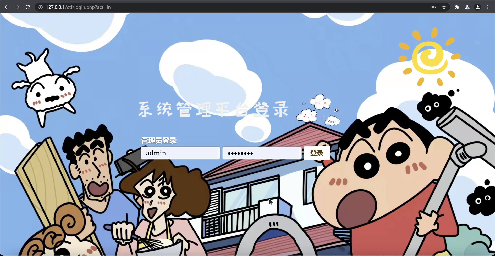
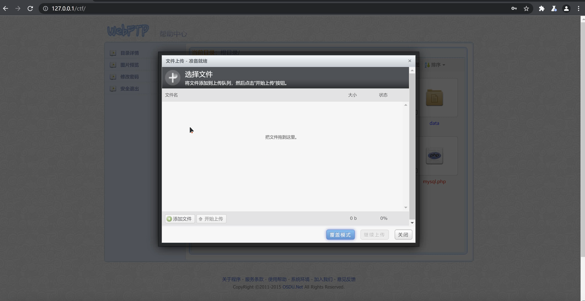

# David-cluns——个人技术总结报告

[TOC]

## 对团队的贡献

-  实验前期搜集相关资料，对漏洞类型进行调研选定
- 与cucwzy合作编写前端代码，实现`build it`的平台展现
- 与后端合作，完善前端样式，实现平台的基本功能及页面展示

## 个人工作介绍

### 1.对漏洞类型的调研选定

- 随着大数据网络时代的到来,Internet 已经成为一个非常重要的平台,人们在享受移动、Web 网络时代带来的便利的同时,各种应用软件的功能和性能上都在不断的完善和提高,但在安全性上,往往遭到忽视,从而导致黑客利用各类漏洞得到服务器的控制权,轻则篡改网页内容,重则窃取重要内部数据,更为严重的则是在网页中植入恶意代码,使得网站访问者受到侵害,Web 安全威胁日益凸显。常见的web漏洞如下：
  - sql注入：所谓SQL注入，就是通过把SQL命令插入到Web表单递交或输入域名或页面请求的查询字符串，最终达到欺骗服务器执行恶意的SQL命令。
  - XSS跨站脚本攻击：攻击者通过在目标网站上注入恶意脚本，使之在用户的浏览器上运行。利用这些恶意脚本，攻击者可获取用户的敏感信息如 Cookie、SessionID等。总而言之，前端能做的事情它都能做到。XSS可分为反射型，存储型和DOM型。
  - CSRF攻击：CSRF攻击的全称是跨站请求伪造（ cross site request forgery)，是一种对网站的恶意利用，尽管听起来跟XSS跨站脚本攻击有点相似，但事实上CSRF与XSS差别很大，XSS利用的是站点内的信任用户，而CSRF则是通过伪装来自受信任用户的请求来利用受信任的网站。你可以这么理解CSRF攻击：攻击者盗用了你的身份，以你的名义向第三方网站发送恶意请求。 CRSF能做的事情包括利用你的身份发邮件、发短信、进行交易转账等，甚至盗取你的账号。
- 在充分调研了Web 应用的漏洞分析与相关研究后，为了使得最终的漏洞设计与破解具有实用性，我们选择了开发建议的文件上传平台，该平台允许以管理员身份登陆以及普通用户的注册登录，同时也允许进行相关的文件上传功能。

### 2.编码技术选择

- 在编写前端内容时仍然采用较为基础的html。选择html一方面是对工具的掌握相对其他前端开发工具而言较为成熟，另一方面HTML允许嵌入图像和对象，并可用于创建交互式表单。HTML提供了一种通过表示文本的结构语义（如标题，段落，列表，链接，引号和其他项目）来创建结构化文档的方法。它可以在JavaScript等语言中嵌入脚本，从而影响HTML网页的行为。当然，在使用html网页设计时同样也遇到了不同程度的问题：
  - 使用HTML设计网站需要更长时间。使用HTML，一个字符不合适就意味着整个网站无法正常加载
  - 对网站进行简单更改所需的时间比愿意花费的时间长得多，因为可能需要一次一页地进行这些更改
  - 另外，html无法做到项目的前后端分离，即我们在完成前端的编写过程中需要与后端进行合作，保证页面展示与功能实现统一。
- 综上所述，我们最终确定了前端采用html进行网页设计，后端采用php进行开发。

### 3.调试前端代码并完善页面展示

- 实际上对于该平台的用户登陆页面的设计与开发在去年的夏季小学期中就积累了相关经验与编码套路，比如在设计用户名和密码的输入以及验证时，基本上会通过设计简单函数（input_key_up、check_submit）来实现，若在表单中查询到对应用户名与密码则登录成功，跳转至`webftp.php`；若未查询到，则返回错误。

  

- 因为在平台搭建阶段后端采用了php开发，故在前端的开发处理上还需要考虑与php的代码融合。在常用的VScode中无法采用live server的方式实时查看改动后页面的展示情况，因此最终借助了Kali系统

  - 在kali中配置相关环境，下载安装PHP、Apache以及MySQL
  - 把代码放置于var/html/www中运行
  - 在浏览器中使用 http://localhost/src/login.php查看相关页面

- 相关页面展示

  - 登陆界面

    

  - 首页

    

  - 上传界面

    

## 总结与反思

- 这一次的夏季小学期实践内容我认为实际上是对大二夏季小学期的回顾以及大三学年所学专业知识的更深层次的实践。通过这次的小学期，从目前的阶段来看我复习了web平台搭建，html的设计基础，kali的使用，同时最重要的是加强了对漏洞的理解，对网络平台上漏洞的产生、实现以及攻破流程有了较深的感悟；从长远的角度看，这次小学期让我对网络空间安全这一领域的重要性有了个人独到的理解和体会，同时我对一个项目的完整开发过程也有了更加深入的了解。
- 这次实验同样也反映了很多问题，我发现自己平时的专业知识理解还有很多都浮于表面，实践能力也存在一定程度的欠缺，很多问题在一开始遇到时还是会不知所措。对于搜索引擎和参考资料的使用也不太熟练。这些也是需要我在后续的学习中不断完善的。

## 参考资料

- [Web应用的漏洞分析与研究](https://kns.cnki.net/kcms/detail/detail.aspx?dbcode=CJFD&dbname=CJFDLAST2022&filename=RJZZ202201031&uniplatform=NZKPT&v=A1ichn5zc1_Q4x5XJ71Xdk_7oRXT8LvG474sdlndJmAe0n6Dr4PCX9npr8CRcljP)
- [WEB安全漏洞深入分析及其安全编码](http://blog.nsfocus.net/web-vulnerability-analysis-coding-security/)
- [CSRF介绍](https://www.cnblogs.com/yblackd/p/12008574.html)
- [PHP零基础入门到精通](https://www.bilibili.com/video/BV18x411H7qD?spm_id_from=333.337.search-card.all.click)
- [XSS漏洞及修复方案](https://blog.csdn.net/why_still_confused/article/details/107444888)

