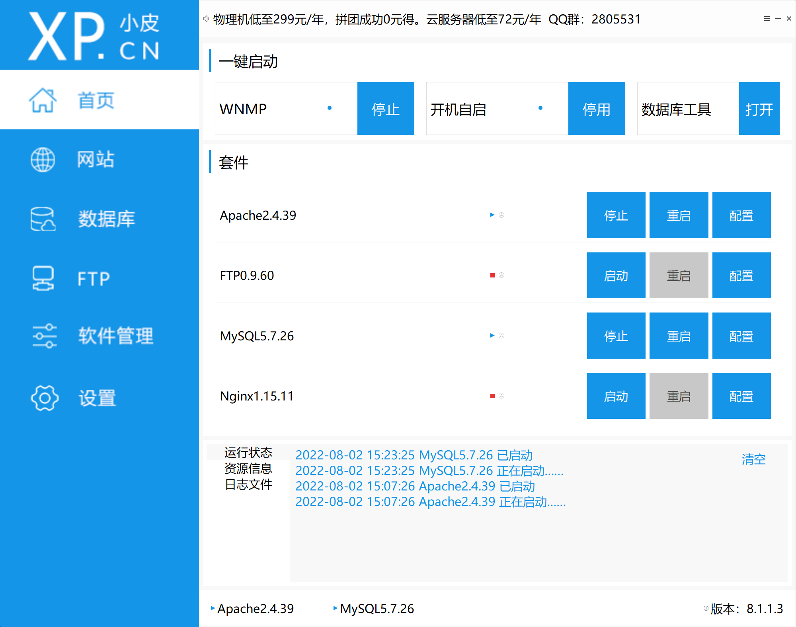
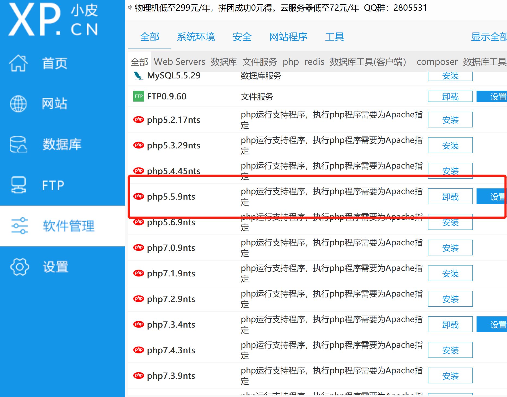
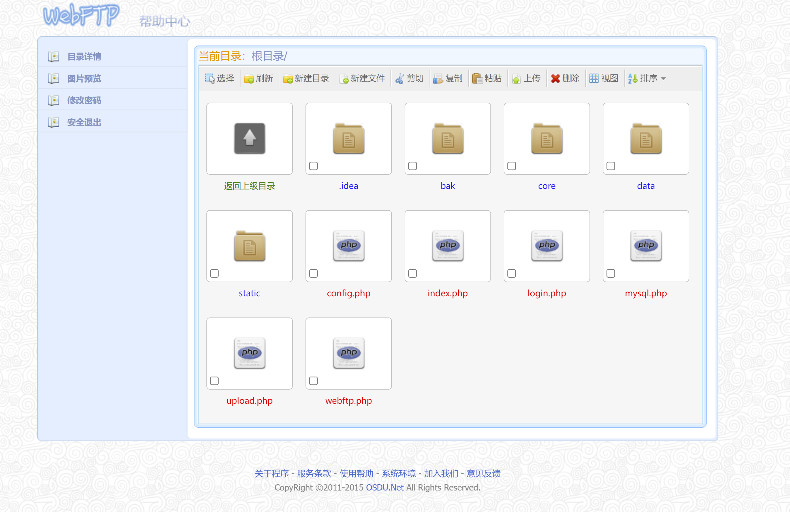
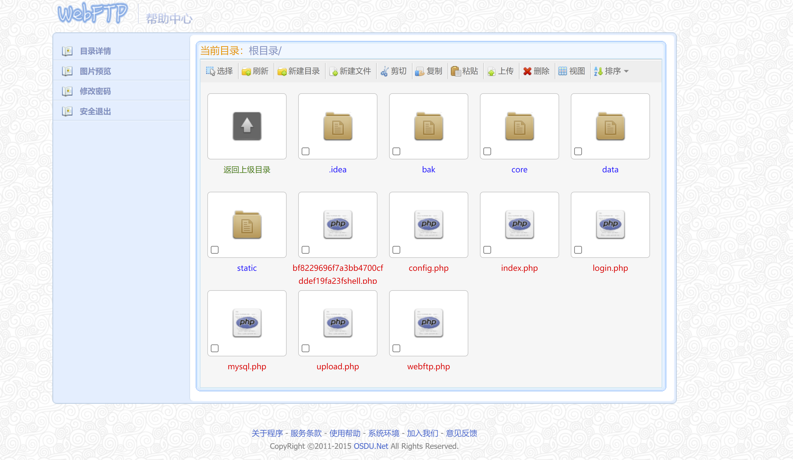
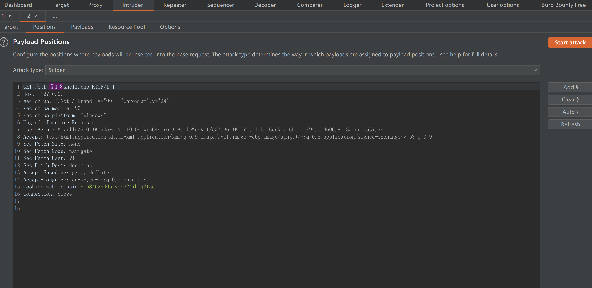
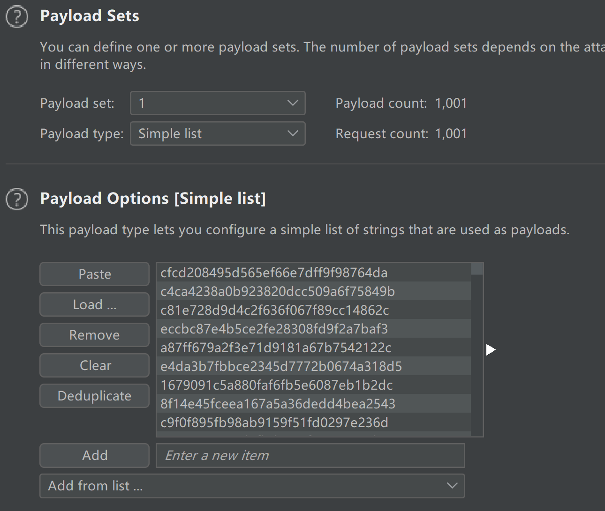
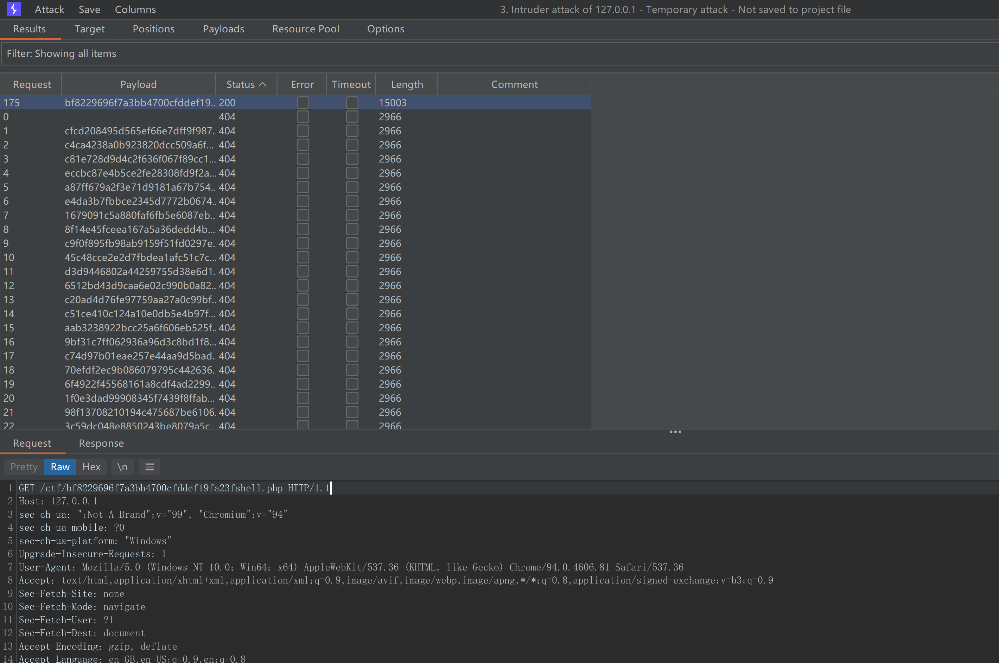
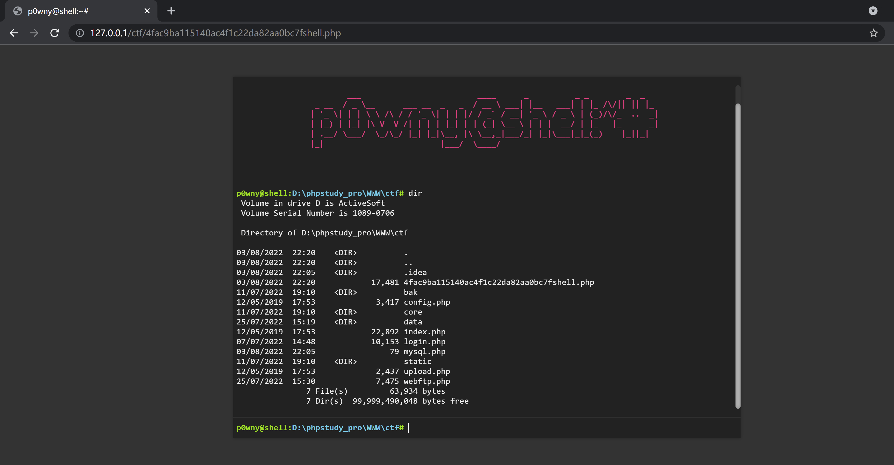

## 一、实验过程

### 1.**环境搭建**

- 使用phpstudy

- 选择php5.5.9的版本，因为php7不兼容

- 然后将SQL文件导入数据库。

### **2.使用SQL注入万能密码登录**

- 在登录界面 用户名 123" union select "21232f297a57a5a743894a0e4a801fc3"# 密码 admin

### 3.上传web shell

- *php webshell下载*地址为https://raw.githubusercontent.com/flozz/p0wny-shell/master/shell.php
- 上传webshell成功

- 由于环境问题，这里直接上传到了 根目录。因为文件被重命名，然后需要爆破出文件名。
- 使用burp爆破

- payload是 1-1000的md5值。

- 爆破结果如下：

- 找到状态码为200的url，直接访问：

- 得到一个php webshell，到此已经getshell了,完成实验。

二、实验总结

1.脚本编写使用了requests库，用来发送请求，代替手工登录后台，上传webshell。

2.从同一个大版本的低级小版本升级到高级小版本不完整，将导致exp不能正常使用，经过修改之后问题得以解决。

3.在环境搭建时遇到了一些问题，浪费了许多时间。