前端网页的设计是主要是使用php文件，代码编写主要是借助`Sublime Text 3`工具来完成，前端主要分为以下3个界面，其对应的php代码如下：

登录页面login.php:

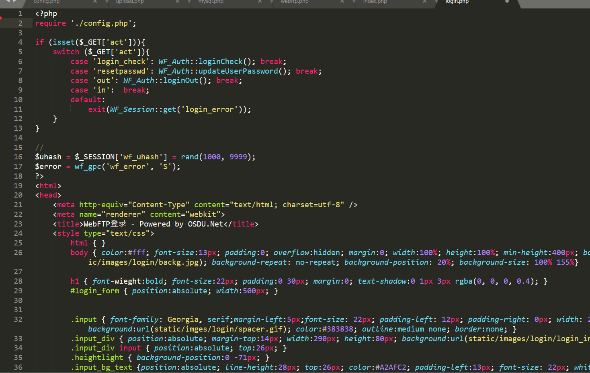

主页面index.php:

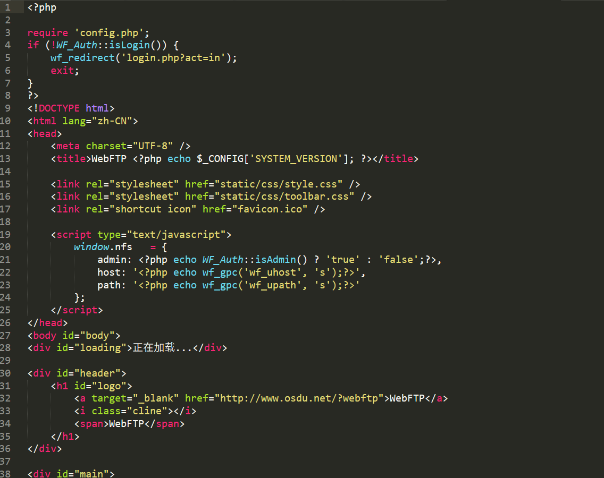

上传页面upload.php:

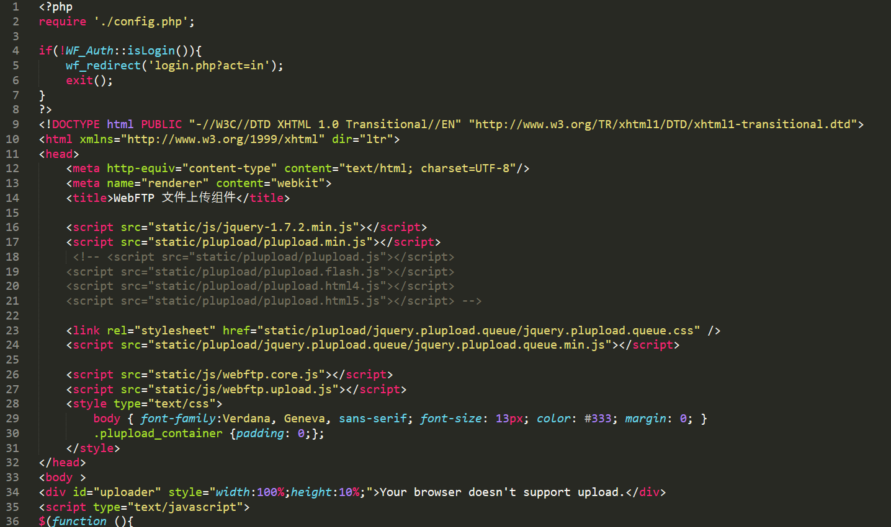

当网页的前端代码全部编写好之后，便需要找到办法来运行这些php文件，来看看所编写页面的展示效果以及需要进一步修改的地方。

首先使用的软件是AppServ,首先将AppServ的安装包下载下来。

之后双击AppServ文件，打开如下图启动页面：

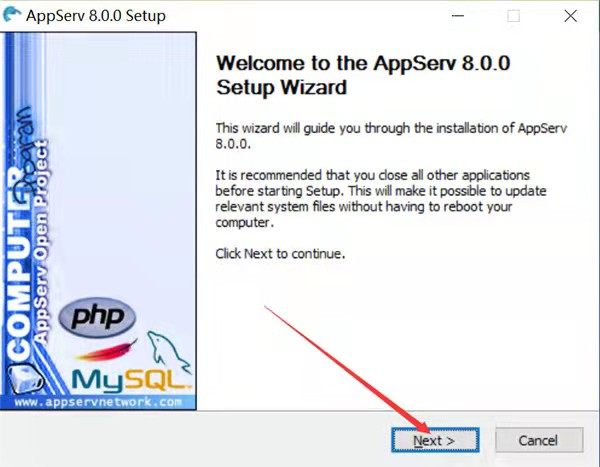

单击Next按钮，打开如下图所示的AppServ安装协议页面：

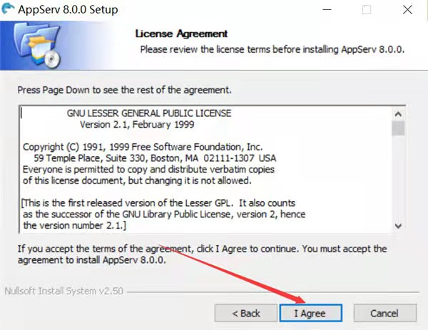

单击I Agree按钮，打开如下图所示的页面。在该页面中可以设置AppServ的安装路径（默认安装路径一般为c:\AppServ），AppServ安装完成后，Apache、MySQL、PHP都将以子目录的形式存储到该目录下：

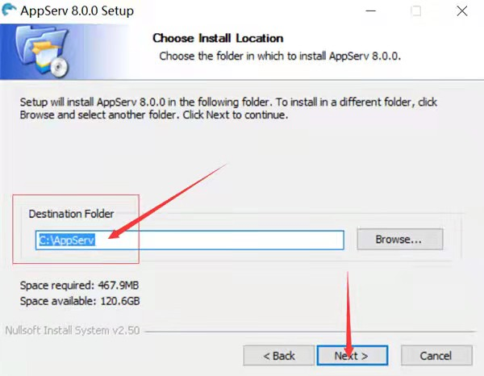

单击Next按钮，打开如下图所示页面，在该页面中可以选择要安装的程序和组件（默认为全选状态）：

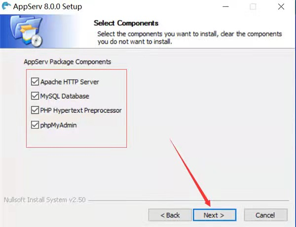

单击Next按钮，打开如下图所示的页面，该页面主要设置Apache的端口号：

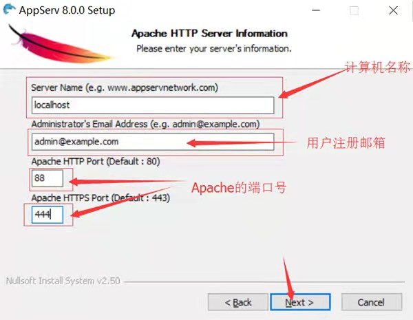

单击Next按钮，打开如下图所示，该页面主要对MySQL数据库的root用户的登录密码及字符集的设置，这里将字符集设置为“GB2312 Simplified Chinese”，表示MySQL数据库的字符集将采用简体中文形式：

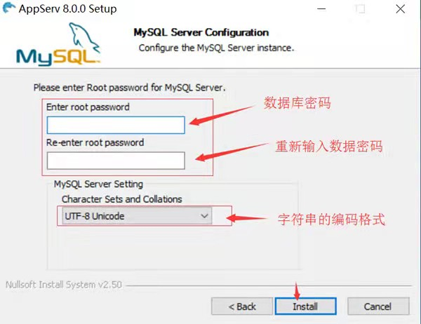

单击Install按钮后开始安装，如下图：

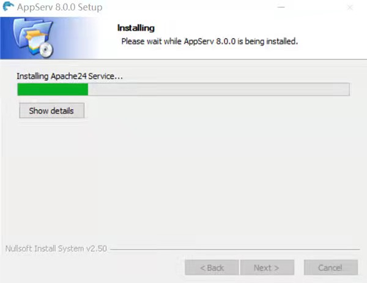

下图为安装完成的界面：

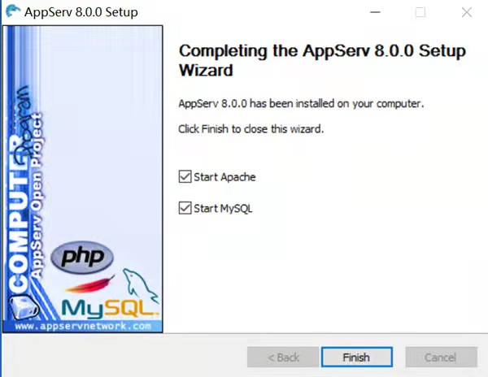

安装好AppServ之后，整个目录默认安装在“c:AppServ”路径下，此目录包含几个子目录：

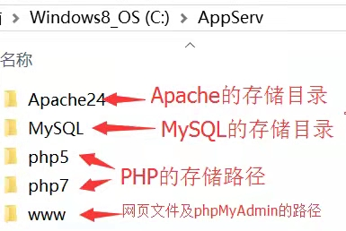

之后将写好的php代码放入www文件夹的路径之下

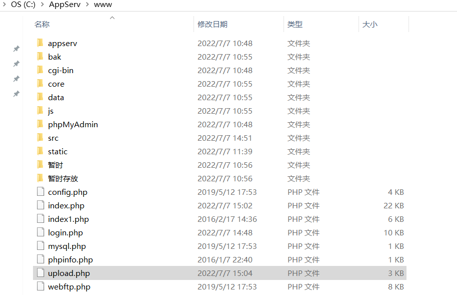

Login.php文件中的主要功能函数即为用户名与密码的输入（input）以及连接数据库后对输入内容与表单进行检查核实（check），若在表单中查询到对应用户名与密码则登录成功，跳转至webftp.php；若未查询到，则返回错误。

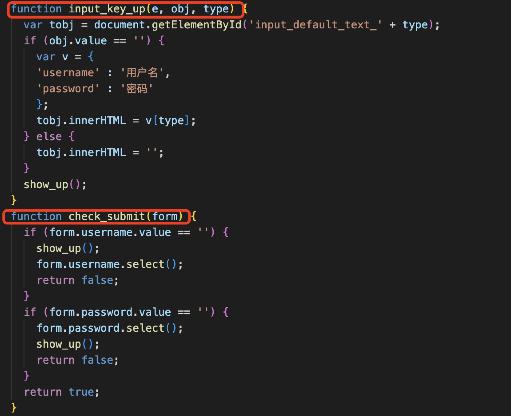

打开浏览器，在地址栏中输入“http://localhost:8080/login.php”, 在经过了多次修改之后，可以看的最终的登陆页面的效果图如下：

之后输入用户名与密码进行登录，发现了以下问题，我们连接不上后面的界面：

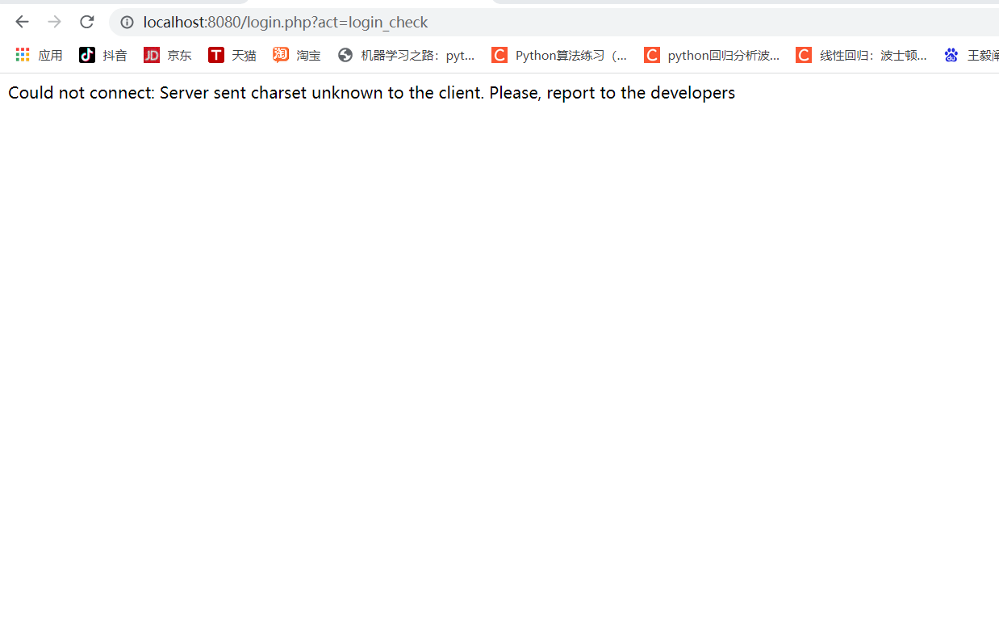

尝试对该问题进行解决，查看下面的代码，发现user路径是找不到的：

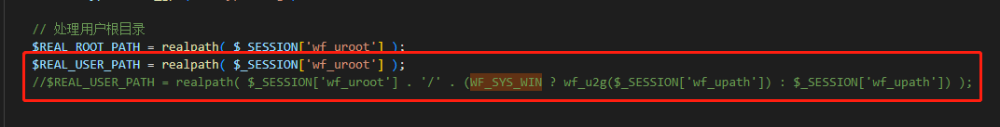

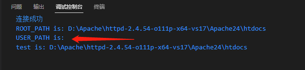

之后将下面的user目录改为root路径，就可以成功进入后面的页面了

输入用户名和密码就可以看见这个页面：

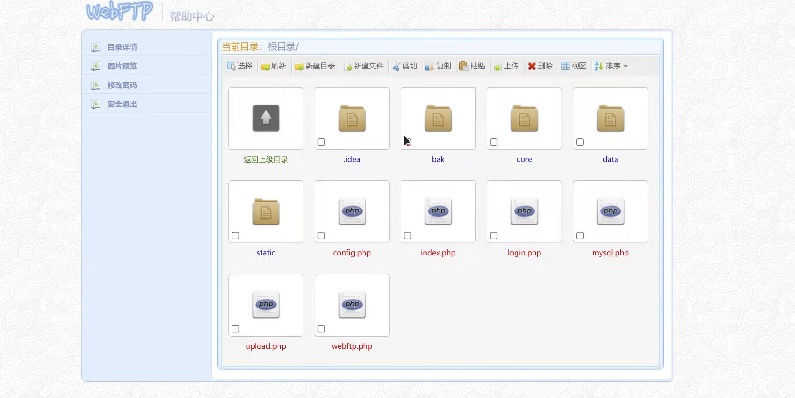

点击该页面中的上传按钮就可以看见上传页面了：

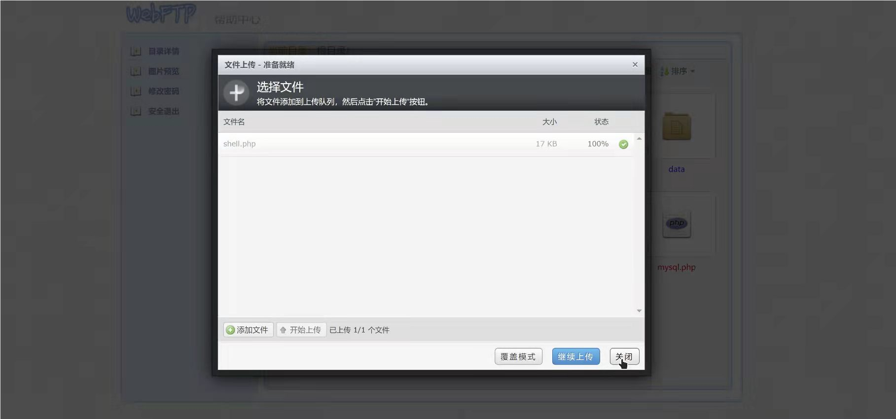

就此前端页面的搭建工作全部完成