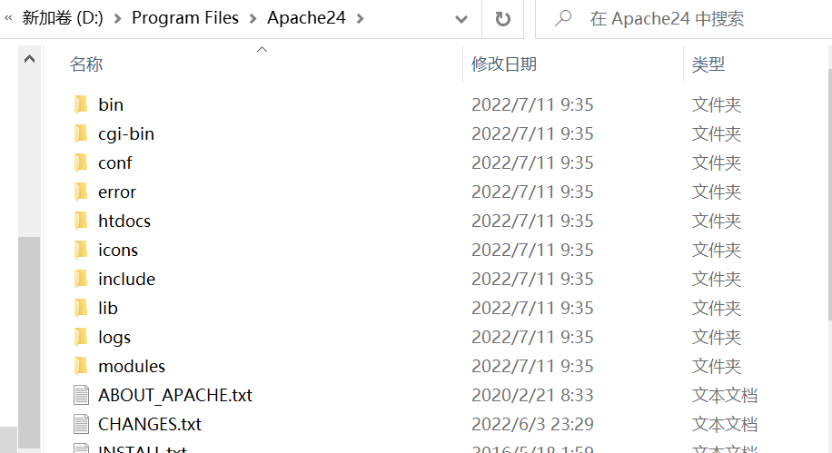

# 「创新实践能力团队赛」总结技术报告——xiting


## 负责工作

在本次实验中，我和zhang-de-xin同学一起完成了后端的部分，在实验中过程中的具体环境搭建以及我所遇到的bug还有及解决过程如下。

## 环境配置

### Apache

首先下载apache安装包

[下载链接](https://www.apachehaus.com/cgi-bin/download.plx)


接下来解压缩到指定文件夹




打开 `conf/httpd.conf`，修改成解压路径。


接下来测试配置文件是否合法

```
httpd -t #测试配置文件是否合法
```


安装apache服务

```
httpd -k install -n Apache2.4 #-n后面表示自定义访问名称
```


接下来就可以启动服务了

```
httpd -k start  #启动
httpd -k stop   #停止
```


接下来进行测试，在浏览器中访问 `http://localhost`


可以看到apache已经配置成功了。


### PHP

首先在官网下载安装包

[下载链接](https://windows.php.net/download)


接下来解压缩


接下来进行配置

```
#加载PHP
LoadModule php_module 'D:/Program Files/php8/php8apache2_4.dll'

#将PHP配置文件加载到Apache配置文件中，共同生效
PHPIniDir 'D:/Program Files/php8'

#配置Apache分配工作给PHP模块，把PHP代码交给PHP处理
#即.php后缀名的文件
AddType application/x-httpd-php .php
```

复制到 `http.conf` 中


上述配置的 `php.ini` 文件默认是不存在的，是以 `development` 和 `production` 格式存在，需要格式化处理。复制一份 `php.ini-development` 重命名为 `php.ini`


接下来进行测试，进入 `Apache` 目录，重启Apache服务，打开cmd，切到 Apache解压目录/bin，输入指令

```
httpd -M
```

可以看到配置修改成功


在 `Apache/htdocs` 目录下新建 `test` 文件。


测试内容为：

```php
<?php
	//测试
	echo 'hello world';
?>

```


启动Apache服务，在浏览器访问http://localhost/test.php


可以看到成功渲染出helloworld（一开始没生效重启Apache服务即可）。


### mysql

以前安装过，这里就不再重新安装赘述。


## 实验问题及解决办法

执行 `mysqli_connect（)` 操作时候，遇到 `Call to undefined function mysqli_connect() in XXX`问题，是因为php.ini的配置问题。

打开php.ini文件，找到On windows 下的这句并修改为：

```
extension_dir = “D:/自己的文件路径/ext” 
```

把php.ini 中的这句去掉分号：

```
;extension=php_mysqli.dll
```


并且加入环境变量：


解决完这个bug又出现了新的bug：


发现是连接数据库时候，密码错误，修改之后就解决了。


然后又出现了新的bug：


发现是变量多写了一个


删掉即可。

然后出现了新的bug：


查文献发现是由于php高版本不再使用 `mysql_connect()` 来连接数据库，所以把所有 `mysql` 改成 `mysqli`下的合法用法


紧接着 `mysql_close` 函数错误


改成合法用法：


## 参考文献

- [apache安装](https://blog.csdn.net/qq_45034708/article/details/108565486?ops_request_misc=%257B%2522request%255Fid%2522%253A%2522165736615716782425180897%2522%252C%2522scm%2522%253A%252220140713.130102334..%2522%257D&request_id=165736615716782425180897&biz_id=0&utm_medium=distribute.pc_search_result.none-task-blog-2~all~top_positive~default-1-108565486-null-null.142^v32^pc_rank_34,185^v2^control&utm_term=apache&spm=1018.2226.3001.4187)
- [PHP安装](https://blog.csdn.net/qq_45034708/article/details/108542598?ops_request_misc=%257B%2522request%255Fid%2522%253A%2522165750728116781432958026%2522%252C%2522scm%2522%253A%252220140713.130102334..%2522%257D&request_id=165750728116781432958026&biz_id=0&utm_medium=distribute.pc_search_result.none-task-blog-2~all~top_positive~default-1-108542598-null-null.142^v32^pc_rank_34,185^v2^control&utm_term=php%E5%AE%89%E8%A3%85&spm=1018.2226.3001.4187)

- [解决mysqli加载问题](https://blog.csdn.net/sxudong2010/article/details/83277285?ops_request_misc=%257B%2522request%255Fid%2522%253A%2522165770656016781435425388%2522%252C%2522scm%2522%253A%252220140713.130102334..%2522%257D&request_id=165770656016781435425388&biz_id=0&utm_medium=distribute.pc_search_result.none-task-blog-2~all~baidu_landing_v2~default-4-83277285-null-null.142^v32^pc_rank_34,185^v2^control&utm_term=%20Call%20to%20undefined%20function%20mysqli_connect%28%29%20in%20&spm=1018.2226.3001.4187)

- [mysql_connect()与mysqli_connect()的区别](https://blog.csdn.net/weixin_35857225/article/details/115628940?ops_request_misc=%257B%2522request%255Fid%2522%253A%2522165787463016781685330107%2522%252C%2522scm%2522%253A%252220140713.130102334.pc%255Fall.%2522%257D&request_id=165787463016781685330107&biz_id=0&utm_medium=distribute.pc_search_result.none-task-blog-2~all~first_rank_ecpm_v1~pc_rank_34-3-115628940-null-null.142^v32^pc_rank_34,185^v2^control&utm_term=mysqli_connect&spm=1018.2226.3001.4187)

- [mysqli_close() 函数用法](https://blog.csdn.net/weixin_35794185/article/details/115901374?ops_request_misc=%257B%2522request%255Fid%2522%253A%2522165787566016782391872203%2522%252C%2522scm%2522%253A%252220140713.130102334.pc%255Fall.%2522%257D&request_id=165787566016782391872203&biz_id=0&utm_medium=distribute.pc_search_result.none-task-blog-2~all~first_rank_ecpm_v1~pc_rank_34-1-115901374-null-null.142^v32^pc_rank_34,185^v2^control&utm_term=mysqli_close&spm=1018.2226.3001.4187)